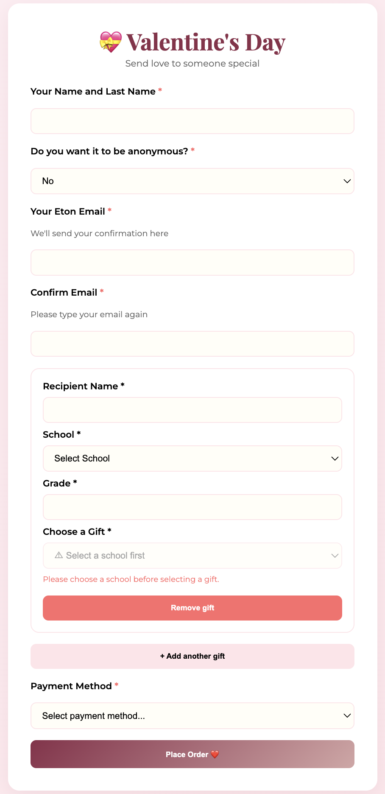
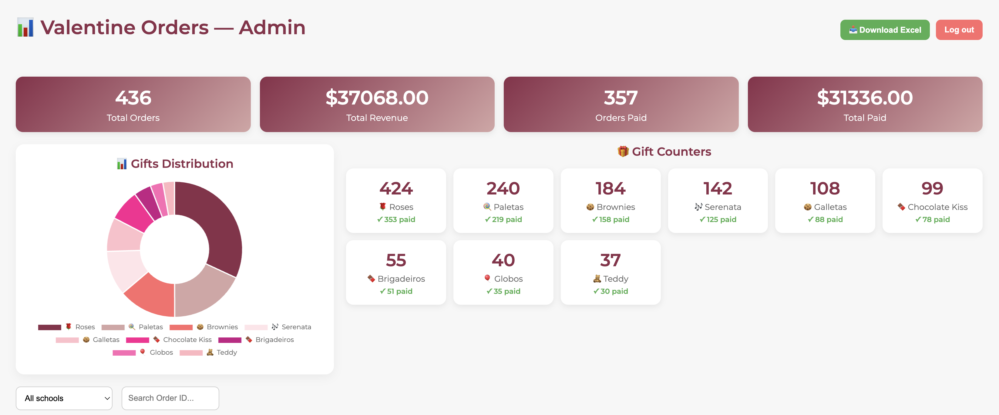
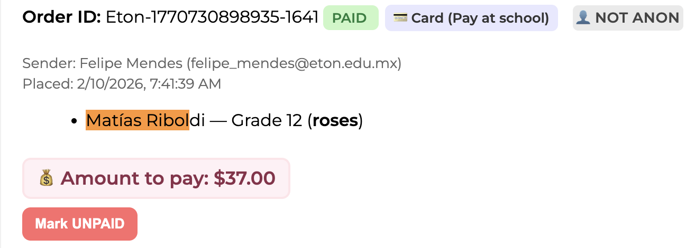

# Valentine's Online Store

A full-stack web application developed to manage my school's annual Valentine's Day gift sales.

The platform allowed students to browse available gifts, place orders online, and enabled organizers to manage inventory, payments, and order fulfillment through a dedicated administrative dashboard.

Originally built for my school's student government, this project demonstrates the development of a complete web application with a real-world backend and administration system.

---

## Features

### Customer Portal

- Browse available Valentine's Day gifts
- Real-time inventory availability
- Online order submission
- Order confirmation (with email reciept and order ID)

### Administration Dashboard

- Secure administrator login
- View and manage all customer orders
- Mark orders as paid or completed
- Inventory management
- Order filtering and searching
- Sales statistics and analytics
- Revenue tracking
- Excel report generation

---

## Technologies Used

### Frontend

- HTML5
- CSS3
- JavaScript

### Backend & Services

- Firebase Realtime Database

### Libraries

- Chart.js
- SheetJS (xlsx)

---

## Project Structure

```
/
├── index.html              # Landing page to check whether the online store is still recieving orders
├── Orders.html             # Customer ordering page
├── admin.html              # Administrator dashboard
├── site.js                 # Order/Database management
├── images
├── README.md
└── LICENSE
```

---

## Screenshots





---

## Key Features

### Customer Experience

- Responsive interface
- Automatic price calculation
- Inventory validation
- Simple ordering workflow

### Administrative Tools

- Secure authentication
- Order management
- Payment tracking
- Inventory monitoring
- Sales analytics
- Export reports to Excel

---

## What I Learned

This project provided experience in:

- Full-stack web development
- Firebase integration
- Database design
- User authentication
- CRUD operations
- Dashboard development
- Data visualization
- Real-world software deployment
- Designing software for non-technical users

---

## Future Improvements

Potential future improvements include:

- Online payment integration (currently only uses payment services such as CLIP)
- Customer accounts
- QR-code order pickup
- Improved inventory automation
- Mobile application

---

## License

This project is licensed under the MIT License.
